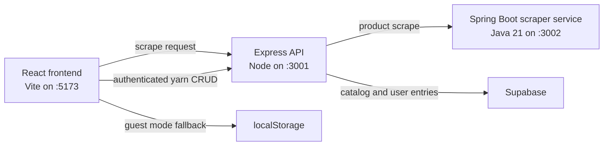

# PricePurl

PricePurl is a yarn price tracking application for people who want to watch products across online shops, save interesting yarns, and keep a record of price changes over time. The project combines a React frontend, a Node/Express API, and a Spring Boot scraper service so the UI, business logic, and scraping concerns stay separated.

## Built With GitHub Copilot

This project was developed with GitHub Copilot as an active pair-programming tool rather than a one-off code generator.

- Copilot helped turn the original MVP idea into working React, Express, and Java service scaffolding.
- It accelerated iteration on repetitive implementation work such as CRUD routes, form wiring, state handling, and scraper boilerplate.
- It was useful for exploring refactor directions as the project moved from a local-first prototype into a Supabase-backed application with optional authentication.
- It supported debugging and polishing by suggesting route shapes, data-normalization logic, UI refinements, and documentation updates.
- The result is still a human-directed project: Copilot sped up drafting and iteration, while the app structure, behavior, and feature decisions were validated and shaped inside the codebase.

If you are reviewing this repository as an example of AI-assisted development, PricePurl is best understood as a practical "Copilot-supported full-stack build" that evolved through many small guided iterations.

## What The App Does

PricePurl lets a user:

- add a yarn manually or from a product URL
- scrape current product information from supported storefronts
- track current price, lowest observed price, and price history
- organize yarns as active or purchased
- keep temporary guest data in the browser or sign in for synced storage

The current application is no longer just a browser-only MVP. It now supports authenticated, backend-backed yarn lists while still allowing guest-mode use in the frontend.

## How It Works



### Frontend

The frontend is a React application built with Vite. It handles:

- the yarn dashboard and detail views
- add/edit flows for yarn entries
- guest-mode storage in `localStorage`
- optional Supabase sign-in and session persistence
- price-history display and client-side price metadata normalization

If `VITE_SUPABASE_URL` and `VITE_SUPABASE_ANON_KEY` are not configured, the frontend still runs in guest mode. In that mode, yarn entries are stored locally in the browser instead of being synced to the backend.

### Backend API

The backend is an Express server that:

- exposes `/scrape` for product lookup
- exposes authenticated `/api/yarn` CRUD routes
- stores yarn catalog records separately from user list entries
- normalizes names for duplicate detection
- maintains price history, lowest price metadata, and project notes

The backend requires Supabase configuration because it is the source of truth for signed-in users and shared catalog records.

### Scraper Service

The scraper service is a separate Spring Boot application written in Java 21.

- It chooses a site-specific scraper when one exists.
- It currently includes a Hobbii-specific scraper that reads Shopify product JSON.
- It falls back to a generic Playwright scraper for other sites.
- It returns product name, current price, regular price, site name, and scrape date.

This split keeps scraping logic isolated from the main API and makes it easier to extend support for more yarn stores over time.

## Typical User Flow

1. A user opens the frontend.
2. The user can continue in guest mode or sign in with Supabase.
3. When a product URL is entered, the frontend calls the backend `/scrape` route.
4. The backend forwards that request to the Java scraper service.
5. The scraper service returns product details and price data.
6. The frontend saves the item either locally for guests or through authenticated backend routes for signed-in users.
7. Price history is preserved so the app can show the current price and lowest recorded price.

## Tech Stack

- Frontend: React 19, Vite, Supabase client
- Backend: Node.js, Express, Supabase service-role access
- Scraping: Spring Boot, Java 21, Microsoft Playwright for Java
- Storage: Supabase for authenticated users, `localStorage` for guest mode

## Repository Layout

```text
PricePurl/
|- frontend/          # React client
|- backend/           # Express API and Supabase integration
|- scraper-service/   # Spring Boot scraping service
|- yarn_tracker_mvp_updated.md
```

## Running The Project Locally

### Prerequisites

- Node.js 20+ recommended
- npm
- Java 21
- Maven
- A Supabase project for authenticated features

### 1. Install dependencies

```bash
cd frontend && npm install
cd ../backend && npm install
cd ../scraper-service && mvn clean install
```

### 2. Configure environment variables

Create `frontend/.env` if you want sign-in enabled:

```bash
VITE_SUPABASE_URL=https://your-project-ref.supabase.co
VITE_SUPABASE_ANON_KEY=your-supabase-anon-key
```

Create `backend/.env` with your backend credentials:

```bash
SUPABASE_URL=https://your-project-ref.supabase.co
SUPABASE_SERVICE_ROLE_KEY=your-supabase-service-role-key
PORT=3001
```

The frontend can run without its Supabase variables, but the backend cannot run without its Supabase configuration.

### 3. Start each service

In three terminals:

```bash
cd scraper-service && mvn spring-boot:run
```

```bash
cd backend && npm start
```

```bash
cd frontend && npm run dev
```

### 4. Open the app

- Frontend: `http://localhost:5173`
- Backend API: `http://localhost:3001`
- Scraper service: `http://localhost:3002`

## Why GitHub Copilot Mattered On This Project

GitHub Copilot was especially helpful because PricePurl spans three different implementation styles at once: modern React UI code, Node/Express API code, and Java scraping code. That kind of project creates a lot of context switching.

Copilot reduced that cost by helping with:

- fast first drafts for components, routes, and service classes
- data-shape consistency across frontend state, API payloads, and storage models
- repetitive refactors as the app evolved from localStorage-first to Supabase-backed
- debugging edge cases around auth state, duplicate yarn detection, and scrape responses
- documentation and cleanup work so the repository stayed understandable as it grew

For this repository, Copilot is part of the development story, not just a tooling footnote.

## Current State

The original MVP notes in `yarn_tracker_mvp_updated.md` describe the first local-first version. The current codebase has moved beyond that baseline and now includes:

- authenticated yarn CRUD through the backend
- shared yarn catalog records in Supabase
- guest-mode fallback in the frontend
- richer price history tracking
- a dedicated Java scraping service

## App Demonstration

https://github.com/user-attachments/assets/f4dbfa7c-029c-43a1-9cb7-6d424af727b8


## Next Directions

Natural next steps for the project include:

- adding more store-specific scrapers
- scheduling automatic refreshes
- expanding analytics around price changes
- improving deployment and production configuration
